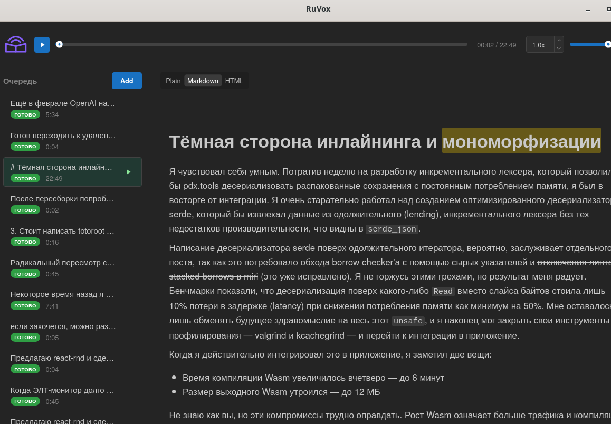

#  RuVox

[Русская версия](./README.ru.md)

[](https://github.com/xilec/RuVox/actions/workflows/ci.yml)


A desktop application for narrating technical Russian-language texts.

Normalizes English terms, abbreviations, code, numbers, and URLs, then pipes the result into [Piper](https://github.com/rhasspy/piper) (in-process via `piper-rs`, primary engine) or, optionally, [Silero TTS](https://github.com/snakers4/silero-models) (out-of-process via the `ttsd` Python sidecar). Unlike a bare TTS, RuVox knows how to read `getUserData()` as «гет юзер дата», `API` as «эй пи ай», and `/api/v2/users` as a path rather than letter by letter.



## Stack

| Layer | Technology |
|-------|------------|
| Shell | [Tauri 2](https://tauri.app/) (Rust + native webview) |
| Frontend | React 18 + TypeScript 5 + [Mantine 8](https://mantine.dev/) |
| Backend | Rust (normalization pipeline, storage, TTS manager) |
| TTS | Piper (in-process, `piper-rs` + `onnxruntime`); Silero (optional, Python 3.12 subprocess `ttsd`) |
| Audio | `tauri-plugin-mpv` (libmpv with `scaletempo2`) |

## Features

- **Normalization** — English (camelCase / snake_case), abbreviations, numbers, dates, URLs, email, code.
- **Markdown + HTML** — rendered and narrated while preserving meaning.
- **Mermaid diagrams** — visualized in the UI; replaced with a «тут мермэйд диаграмма» marker for TTS.
- **Word highlight** — synchronous highlighting of the currently narrated word during playback.
- **Preview dialog** — preview the normalized text before synthesis.
- **System tray** — close-to-tray, background mode.

## Requirements

- **OS:** Linux (X11 or Wayland).
- **Nix:** recommended — the entire toolchain (Rust, Node, Python, Tauri deps) is built from `flake.nix` (dev shell lives in `nix/devshell.nix`).
- **Without Nix:** Linux distribution that ships `webkit2gtk-4.1` (Ubuntu 24.04+, Debian 13+, Fedora 40+, Arch). Detailed step-by-step build guide: [docs/install.md](docs/install.md). Python 3.12 + `uv` are only required if you want to use Silero (the `ttsd` sidecar).

## Dev environment

```bash
# Interactive shell
nix develop
pnpm install
pnpm tauri dev

# Or run a single command without entering the shell
nix develop -c pnpm install
nix develop -c pnpm tauri dev
```

All commands in the docs assume execution inside `nix develop` (or via `nix develop -c ...`).

## Production build

```bash
# Default (slim) — Piper only, no Python/torch/Silero in the closure.
nix build .#ruvox
./result/bin/ruvox

# Opt-in (full) — bundles the ttsd sidecar so Silero is also available.
nix build .#ruvox-with-silero
./result/bin/ruvox
```

Both variants build the Tauri release binary and wrap it via `wrapProgram` (runtime `LD_LIBRARY_PATH` + `GIO_EXTRA_MODULES`) with `mpv` in `PATH`. `.#ruvox-with-silero` additionally puts the `ttsd` (Silero subprocess) binary in `PATH`; `.#ruvox` does not, and the Settings dialog greys the Silero engine out at runtime.

> **First `nix build` run:** the `frontend` derivation uses `pnpm.fetchDeps` with `lib.fakeHash` — Nix will fail with a hash mismatch and print the real hash; substitute it into `flake.nix` and re-run the build. This is the standard pnpm2nix procedure.

## Tests

```bash
pnpm typecheck                                                  # TypeScript
cargo test --manifest-path src-tauri/Cargo.toml                 # Rust (incl. pipeline golden tests)
cargo test --manifest-path src-tauri/Cargo.toml --test golden   # golden tests only
cd ttsd && uv run python -m pytest                              # Python subprocess
```

## Documentation

| File | Description |
|------|-------------|
| [AGENTS.md](AGENTS.md) | Development rules, project structure, conventions |
| [docs/install.md](docs/install.md) | Building from source on Linux without Nix (Ubuntu 24.04+) |
| [docs/ipc-contract.md](docs/ipc-contract.md) | Tauri commands, events, ttsd protocol |
| [docs/storage-schema.md](docs/storage-schema.md) | `history.json` schema, timestamps, config |
| [CHANGELOG.md](CHANGELOG.md) | Change history |

## License

GPL-3.0 — see [LICENSE.md](LICENSE.md).
