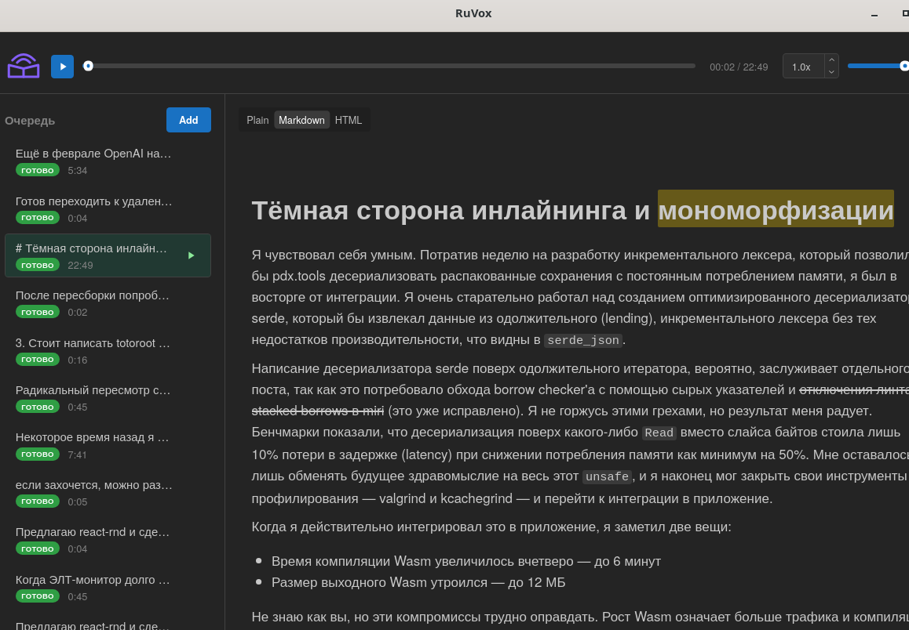

#  RuVox

[English version](./README.md)

[](https://github.com/xilec/RuVox/actions/workflows/ci.yml)


Desktop-приложение для озвучивания технических текстов на русском языке.

Нормализует английские термины, аббревиатуры, код, числа, URL и передаёт результат в один из трёх TTS-движков: [Piper](https://github.com/rhasspy/piper) (in-process, через `piper-rs`, движок по умолчанию), Silero TTS v5 in-process на ONNX Runtime (крейт [`silero-native`](silero-native/), бандл модели скачивается по запросу) или, опционально, [Silero TTS](https://github.com/snakers4/silero-models) out-of-process через Python-сайдкар `ttsd` (оставлен как fallback). В отличие от голого TTS, RuVox умеет читать `getUserData()` как «гет юзер дата», `API` как «эй пи ай», `/api/v2/users` как путь, а не по буквам.

Синтез полностью локальный — никаких облачных TTS, текст никуда не отправляется. Сеть используется только для одноразового скачивания голосовых моделей по запросу.



## Стек

| Слой | Технология |
|------|------------|
| Shell | [Tauri 2](https://tauri.app/) (Rust + нативный webview) |
| Frontend | React 18 + TypeScript 5 + [Mantine 8](https://mantine.dev/) |
| Backend | Rust (pipeline нормализации, storage, TTS-менеджер) |
| TTS | Piper (in-process, `piper-rs` + `onnxruntime`, по умолчанию); Silero v5 нативный (in-process, ONNX Runtime, крейт [`silero-native`](silero-native/)); Silero через `ttsd` (опциональный Python 3.12 subprocess, fallback) |
| Аудио | `tauri-plugin-mpv` (libmpv с `scaletempo2`) |

## Возможности

- **Нормализация** — английский (camelCase/snake_case), аббревиатуры, числа, даты, URL, email, код.
- **Markdown + HTML** — рендер и озвучивание с сохранением смысла.
- **Mermaid-диаграммы** — визуализация в UI; для TTS заменяются маркером «тут мермэйд диаграмма».
- **Подсветка слов** — синхронная подсветка читаемого слова в тексте во время воспроизведения.
- **Preview-диалог** — предпросмотр нормализованного текста до синтеза.
- **Системный трей** — close-to-tray, фоновый режим.

## Требования

- **ОС:** Linux (X11 или Wayland).
- **Nix:** рекомендуется — всё окружение (Rust, Node, Python, Tauri-deps) собирается из `flake.nix` (dev-shell живёт в `nix/devshell.nix`).
- **Без Nix:** дистрибутив Linux, в котором есть `webkit2gtk-4.1` (Ubuntu 24.04+, Debian 13+, Fedora 40+, Arch). Подробная пошаговая инструкция по сборке: [docs/install.md](docs/install.md) (на английском). Python 3.12 + `uv` нужны только для Python-движка Silero (сайдкар `ttsd`) — Piper и нативный движок Silero в них не нуждаются.

## Dev-окружение

```bash
# Интерактивная оболочка
nix develop
pnpm install
pnpm tauri dev

# Или одну команду без входа в оболочку
nix develop -c pnpm install
nix develop -c pnpm tauri dev
```

Все команды в документации подразумевают запуск внутри `nix develop` (либо через `nix develop -c ...`).

## Сборка production-бинаря

```bash
# По умолчанию (slim) — Piper + нативный Silero, без Python/torch в closure.
nix build .#ruvox
./result/bin/ruvox

# Опционально (full) — дополнительно встраивает сайдкар ttsd, чтобы был
# доступен Python-движок Silero.
nix build .#ruvox-with-silero
./result/bin/ruvox
```

Оба варианта собирают release-бинарь Tauri и оборачивают его через `wrapProgram` (runtime `LD_LIBRARY_PATH` + `GIO_EXTRA_MODULES`); `mpv` в обоих случаях попадает в `PATH`. Вариант `.#ruvox-with-silero` дополнительно кладёт в `PATH` бинарь `ttsd` (Silero Python subprocess). Slim-вариант его не содержит — на runtime в Settings опция Python-движка Silero окрашена серым. Нативный движок Silero работает в обоих вариантах — его бандл ONNX-моделей (~230 МБ) скачивается по запросу из Settings.

> **Первый запуск `nix build`:** derivation `frontend` использует `pnpm.fetchDeps` с `lib.fakeHash` — Nix упадёт с hash mismatch, напишет реальный hash; его нужно подставить в `flake.nix` и повторить build. Это стандартная процедура pnpm2nix.

## Тесты

```bash
pnpm typecheck                                                  # TypeScript
cargo test --manifest-path src-tauri/Cargo.toml                 # Rust (включая golden-тесты pipeline)
cargo test --manifest-path src-tauri/Cargo.toml --test golden   # только golden-тесты
cargo test --manifest-path silero-native/Cargo.toml             # нативный движок Silero (bundle-gated тесты скипаются без SILERO_NATIVE_BUNDLE)
cd ttsd && uv run python -m pytest                              # Python subprocess
```

## Документация

| Файл | Описание |
|------|----------|
| [AGENTS.md](AGENTS.md) | Правила разработки, структура проекта, соглашения |
| [docs/install.md](docs/install.md) | Сборка из исходников на Linux без Nix (Ubuntu 24.04+, на английском) |
| [silero-native/](silero-native/) | Крейт нативного движка Silero v5 (ONNX Runtime): архитектура, экспорт бандла, parity-тесты (на английском) |
| [openspec/specs/](openspec/specs/) | Спецификации поведения (OpenSpec): IPC, хранилище, pipeline, UI, плеер |
| [CHANGELOG.md](CHANGELOG.md) | Хронология изменений |

## Лицензия

GPL-3.0 — см. [LICENSE.md](LICENSE.md).
